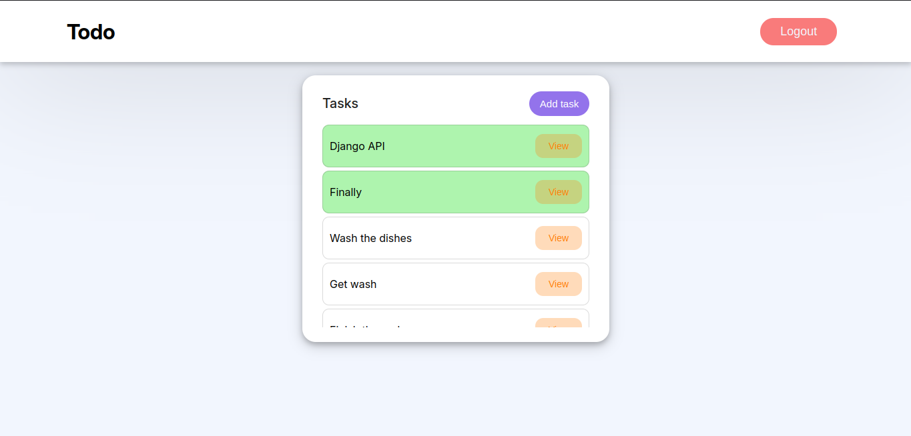

# Todo List App

## About the Project

This is a simple Todo List app built using Django Class-Based Views (CBV). It allows users to manage tasks efficiently with options to add, update, and delete tasks. Also, it comes with login and logout functionality.
## Built With
- Django

## Getting Started

### Prerequisites
Before running the app, ensure you have Python installed. You'll also need to create and activate a virtual environment.

### Installation

1. **Create a virtual environment:**

   ```bash
   python -m venv .venv
2. **Activate the virtual environment:**
   ```bash
   .venv\Scripts\activate
   
3. **Install dependencies:**
   
    After activating the virtual environment, install the required modules listed in requirements.txt:
   ```bash
   pip install -r requirements.txt

4. **Run database migrations:**

   ```bash
   python manage.py migrate

5. **python manage.py runserver**

   ```bash
   python manage.py runserver

Now, you can access the app by navigating to http://127.0.0.1:8000/ in your browser.


